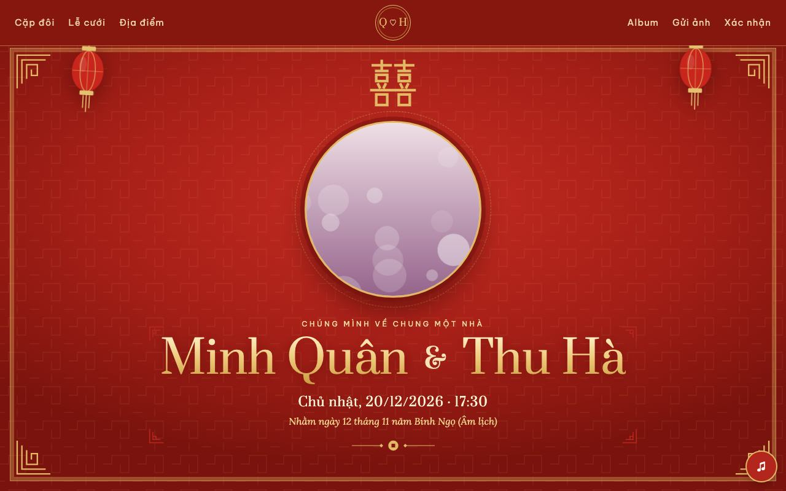
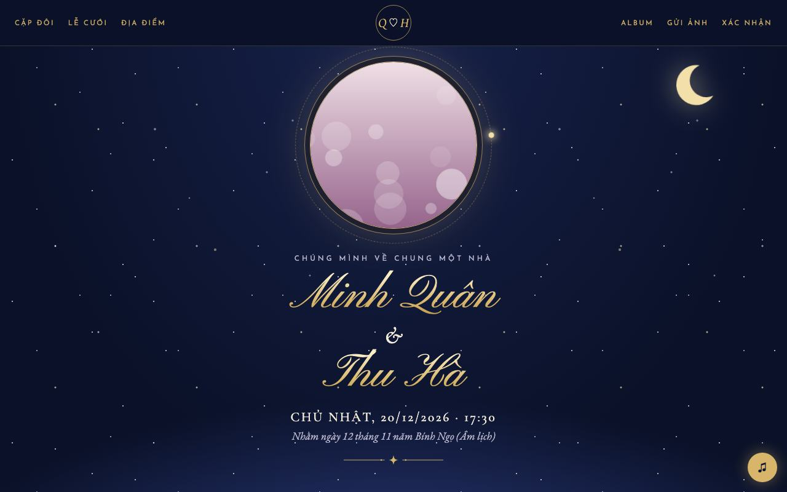
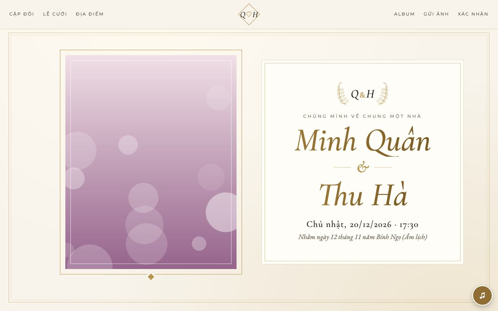
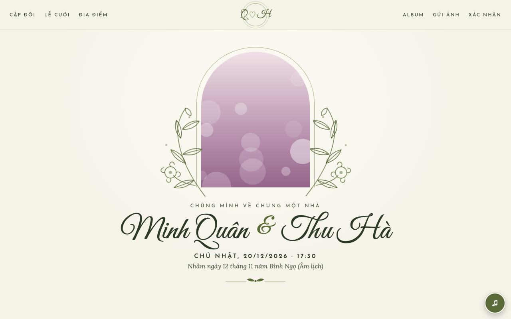

# jagame · Thiệp cưới online miễn phí ♡

**Trang cưới của riêng hai bạn, đẹp như thiệp in, sửa dễ như gõ tin nhắn. Miễn phí cho mọi người.**

Tải về, bấm chạy là có ngay link `https://xxxx.jagame.vn` để gửi khách mời. Trang có thiệp mời riêng từng người, khách xác nhận tham dự, để lại lời chúc và gửi ảnh qua mã QR. Ảnh cưới nằm trên máy của bạn, không quảng cáo, không thu phí.

🌐 **Trang giới thiệu: [jagame.vn](https://jagame.vn)**  ·  ▶ **[Xem web demo](https://demo.jagame.vn)** (quản trị: `demo` / `demo2026`)  ·  ♡ **[Ủng hộ dự án](https://jagame.vn/donate/)**

<p align="center">
  
  
  
  
</p>

---

## 🔗 Liên kết nhanh

| | |
|---|---|
| 🌐 **Trang giới thiệu** | https://jagame.vn |
| ▶ **Web demo** | https://demo.jagame.vn — quản trị: https://demo.jagame.vn/admin (`demo` / `demo2026`, dữ liệu tự khôi phục mỗi giờ) |
| 💌 **Thiệp mời mẫu** | https://demo.jagame.vn/co-chu-lan-hung |
| ⬇️ **Bản phát hành mới nhất (v0.2.0)** | [Windows (.zip)](https://jagame.vn/download/anhcuoi-windows.zip) · [macOS / Linux (.zip)](https://jagame.vn/download/anhcuoi-mac-linux.zip) · [Ghi chú phát hành](https://github.com/phamduybk/ThiepCuoi/releases) |
| ♡ **Ủng hộ** | https://jagame.vn/donate/ |

## 🚀 Cài đặt: tải về, bấm chạy

### Bước 1: Tải về
Bấm nút xanh **`<> Code`** ở đầu trang này, chọn **`Download ZIP`**, rồi giải nén ra một thư mục, ví dụ `D:\ThiepCuoi`.

> Hoặc tải bản gọn hơn tại https://jagame.vn (mục **Tải về**).

### Bước 2: Chạy

**🪟 Windows 10/11**
- Bấm đúp **`run_window.bat`**.
- Nếu Windows báo *"Windows protected your PC"*, bấm **More info → Run anyway**.
- Lần đầu có thể cần cài **Microsoft Visual C++ Redistributable** (thư viện PHP cần): script tự tải và cài, bạn chỉ cần bấm **Yes**. Không tự tải được thì tải tay [vc_redist.x64.exe](https://aka.ms/vs/17/release/vc_redist.x64.exe), cài xong bấm đúp `run_window.bat` lần nữa.

**🍎 macOS**: cần PHP, chỉ cài một lần. Mở ứng dụng **Terminal** rồi gõ:
```bash
brew install php                      # chưa có Homebrew: xem https://brew.sh
cd ~/Downloads/ThiepCuoi-main         # thư mục vừa giải nén (xem ghi chú bên dưới)
bash run_mac.sh
```

**🐧 Linux (Ubuntu/Debian)**
```bash
sudo apt install php-cli php-sqlite3 php-gd php-zip php-curl php-mbstring curl unzip
cd ~/Downloads/ThiepCuoi-main         # thư mục vừa giải nén (có file run_mac.sh)
bash run_mac.sh
```

> **Tên thư mục** tùy nơi tải: `ThiepCuoi-main` (nút `<> Code` → Download ZIP), `ThiepCuoi-<phiên bản>` (vd `ThiepCuoi-0.2.0`,
> tải ở trang Releases) hoặc `anhcuoi` (gói tải ở jagame.vn). Cách chắc ăn: gõ `cd ` (có dấu cách) rồi **kéo thư mục vừa
> giải nén thả vào cửa sổ Terminal**, bấm Enter.

### Bước 3: Tạo trang cưới
1. Trình duyệt tự mở trang cài đặt. Không tự mở thì gõ địa chỉ in trong cửa sổ chương trình (thường là **http://localhost:8686**).
2. Điền tên chú rể, cô dâu, ngày cưới, đặt mật khẩu, rồi bấm **Tạo trang cưới**.
3. Khoảng 1 phút sau, link riêng `https://xxxx.jagame.vn` hiện ở **Quản trị → Gửi link & QR**. Gửi link này cho khách.

> ⚠️ Máy tính phải **bật** và cửa sổ chương trình phải **đang chạy** thì khách mới xem được trang, vì ảnh nằm trên máy bạn. Tắt rồi chạy lại thì link cũ vẫn dùng tiếp.

---

## ✨ Tính năng

| | |
|---|---|
| ✏️ **Sửa trực tiếp trên trang** | Bấm vào chữ để gõ, bấm vào ảnh để thay, kéo để căn khuôn mặt vào khung |
| 🎨 **10 giao diện** | Bạc hà · Oải hương · Hoàng hôn · Thiệp cưới · Hoàng kim · Song hỷ · Tạp chí · Vườn hoa · Đêm sao · Đất nung |
| 💌 **Thiệp mời riêng từng người** | Mỗi khách một link (`…/co-chu-lan-hung`), mở ra là phong bì ghi tên họ. Có 16 xưng hô với lời mời mẫu đúng vai vế |
| ✅ **Xác nhận tham dự** | Khách trả lời ngay trên thiệp. Thống kê theo nhà trai và nhà gái, xuất Excel |
| 📤 **Gửi qua Zalo / Messenger** | Nút **Gửi thiệp** soạn sẵn lời mời kèm link |
| 📷 **Khách gửi ảnh qua QR** | Đặt mã QR trên bàn tiệc, khách quét là gửi ảnh |
| 🎵 **Nhạc nền và hiệu ứng** | Nhạc cưới cổ điển có sẵn hoặc bài của bạn. Hiệu ứng tim, hoa đào, tuyết, kim tuyến, sao |
| 🌙 **Âm lịch và đếm ngược** | Tự tính ngày Âm lịch, đếm ngược tới giờ cưới |
| 🔗 **Link riêng** | Tự có `xxxx.jagame.vn`. Muốn tên đẹp như `minh-lan.jagame.vn` thì gửi yêu cầu |
| 🔒 **Riêng tư** | Ảnh lưu trên máy bạn. Khóa trang hoặc album bằng mật khẩu |

## 📖 Cách dùng

1. **Sửa trang:** vào http://localhost:8686, bấm vào chữ hoặc ảnh có viền nét đứt. Chọn giao diện, nhạc, hiệu ứng ở thanh dưới cùng.
2. **Cho khách xem:** bấm **Cho khách xem**, trang sẽ công khai.
3. **Mời khách:** vào **Quản trị → Khách mời**.
   - Chọn xưng hô, gõ tên. Lời mời tự điền theo mẫu, hoặc bạn viết lời riêng.
   - Bấm **Gửi thiệp** để gửi qua Zalo.
4. **Theo dõi:** trang **Tổng quan** cho biết ai đã mở thiệp, ai tham dự, bao nhiêu người.

<details>
<summary><b>Gặp lỗi?</b></summary>

- **Windows báo thiếu `VCRUNTIME140.dll`:** chạy lại `run_window.bat` (tự cài Visual C++) hoặc tải tay [vc_redist.x64.exe](https://aka.ms/vs/17/release/vc_redist.x64.exe).
- **Cổng 8686 đang bận:** chương trình tự chuyển sang 8687. Xem địa chỉ in trong cửa sổ.
- **Link jagame chưa hiện:** kiểm tra Internet, chương trình sẽ tự thử lại. Trong lúc chờ có link tạm `trycloudflare`.
- **Bị treo:** chạy `reset_win.bat` (Windows) hoặc `bash reset_mac.sh`, rồi chạy lại. Lệnh này chỉ tắt Ảnh Cưới của thư mục này và không xóa dữ liệu.
- **Quên mật khẩu:** mở cửa sổ lệnh trong thư mục chương trình rồi chạy (máy hỏi mật khẩu mới 2 lần). Trên macOS/Linux khi gõ mật khẩu sẽ không hiện chữ, đó là bình thường. Trên Windows chữ có hiện — đừng để người khác nhìn màn hình.
  - Windows: `php\php.exe index.php cli doi_mat_khau`
  - macOS/Linux: `php index.php cli doi_mat_khau`
- Hướng dẫn đầy đủ nằm trong file [`HUONG-DAN-CAI-DAT.txt`](HUONG-DAN-CAI-DAT.txt).
</details>

---

## ♡ Ủng hộ dự án

jagame miễn phí và sẽ luôn miễn phí. Nếu dự án giúp ích cho ngày vui của bạn, một ly cà phê ủng hộ là động lực để mình tiếp tục phát triển.

<p align="center">
  
  &nbsp;&nbsp;
  
</p>

- **Chuyển khoản / VietQR:** MB Bank (ViettelPay), số tài khoản `9704 2292 4626 5222`, chủ tài khoản PHAM QUANG DUY
- **MoMo:** `0366 793 686`, PHAM QUANG DUY

Gửi kèm **tên hoặc lời nhắn** khi chuyển, mình sẽ ghi tên bạn vào Bảng Vàng ♡

### 🏆 Bảng vàng

| Người ủng hộ | Lời nhắn |
|---|---|
| *Chờ người đầu tiên ♡* | |

---

<sub>Thành phần bên thứ ba:
- CodeIgniter 3 (MIT).
- Phông chữ Google Fonts (SIL OFL 1.1).
- Nhạc cổ điển: bản quyền tự do và CC BY 3.0 (Kevin MacLeod, incompetech.com).

Báo lỗi và góp ý: tạo *Issue*.</sub>
